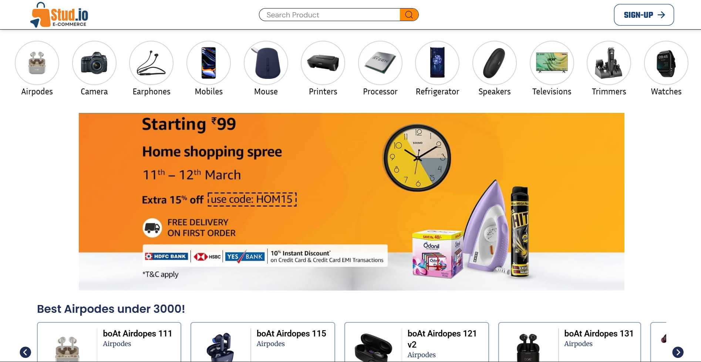
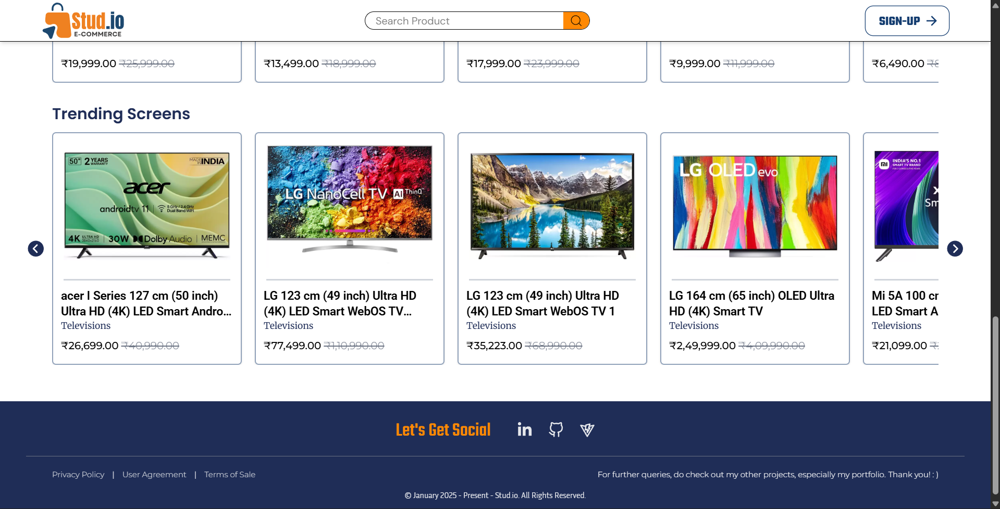
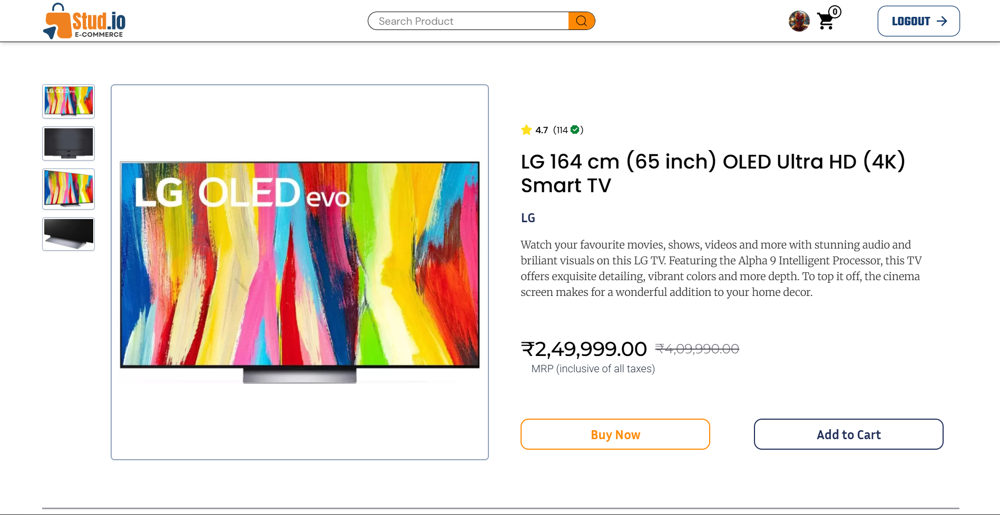
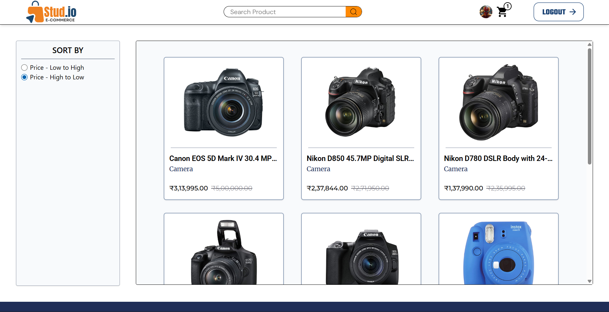
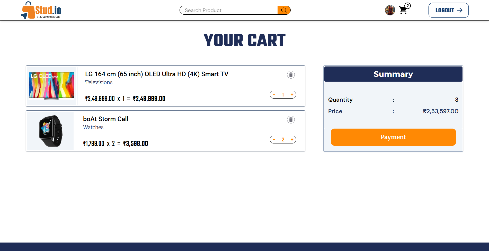
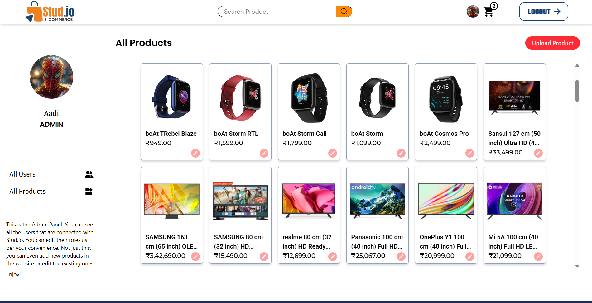

# Stud.io - E-Commerce Frontend




Stud.io is a modern, fully-responsive e-commerce web application built with the MERN Stack. It provides a comprehensive shopping experience with product browsing, cart management, user authentication, and admin controls for managing products and users.

## Tech Stack

- **Frontend**: React 19, TypeScript, Tailwind CSS, Vite
- **State Management**: Redux Toolkit
- **Routing**: React Router v7
- **UI Components**: React Icons, React Toastify
- **Build Tool**: Vite with SWC

## Features

- **User Authentication**: Secure sign-up, sign-in, and password recovery
- **Product Browsing**: Browse all products with filtering and search capabilities
- **Category Navigation**: Explore products by category
- **Product Details**: View detailed information about each product with images
- **Shopping Cart**: Add, update, and remove items from cart with real-time updates
- **User Roles**: Support for different user roles (Customer, Admin)
- **Admin Dashboard**: Manage products and users
  - Add and edit products
  - Upload product images
  - Change user roles
  - View all users
  - Product management with detailed controls
- **Responsive Design**: Optimized for desktop, tablet, and mobile devices
- **Real-time Notifications**: Toast notifications for user feedback
- **Image Handling**: Efficient image upload and base64 conversion for products

## Pre-requisites

Before you begin, ensure you have met the following requirements:

- Node.js (v14 or higher) and npm installed on your machine
- Backend API server running (ensure VITE_API_URL is configured)
- Modern web browser with JavaScript enabled

## Project Structure

```
src/
├── components/       # Reusable UI components
├── pages/           # Page components for routing
├── store/           # Redux store and slices
├── context/         # React context providers
├── helpers/         # Utility functions
├── routes/          # Route configuration
├── assets/          # Static assets and images
└── common/          # Common utilities and role definitions
```

## How to Run the Project Locally

1. **Clone the repository**:
   ```bash
   git clone https://github.com/yourusername/e-commerce-frontend.git
   cd e-commerce-frontend
   ```

2. **Install dependencies**:
   ```bash
   npm install
   ```

3. **Set up environment variables**:
   - Create a `.env` file in the root directory
   - Add the following variables:
     ```
     VITE_API_URL=http://localhost:8000
     ```

4. **Run the development server**:
   ```bash
   npm run dev
   ```

5. **Access the application**:
   - Open your browser and navigate to `http://localhost:5173`

## Available Scripts

- `npm run dev` - Start the development server with hot module replacement
- `npm run build` - Build the project for production
- `npm run preview` - Preview the production build locally
- `npm run lint` - Run ESLint to check code quality

## Deployed Link

Check out the live version of Stud.io - https://studio-ecommerce.vercel.app

## Key Components

- **Header**: Navigation bar with cart and user menu
- **Footer**: Application footer with links and information
- **Product Display**: Various product card components for different layouts
- **Shopping Cart**: Full-featured cart with checkout flow
- **Admin Panel**: Complete admin dashboard for managing products and users
- **Authentication**: Sign-in, Sign-up, and Password recovery pages

## State Management

The application uses Redux Toolkit for centralized state management with slices for:
- User authentication and profile
- Product data
- Shopping cart management
- UI state and notifications

## Project Wireframes

Below are the wireframes showcasing the design and layout of the Stud.io application:

| Home Page Catalogue | Product Details |
|-----------|-----------------|
|  |  |

| Product Listing | Shopping Cart |
|-----------|----------|
|  |  |

| Admin Dashboard |
|----------|
|  |

## Contributing

Contributions are welcome! Please feel free to submit a Pull Request.

## License

This project is licensed under the MIT License - see the LICENSE file for details.

---

**Built with ❤️ using React, TypeScript, and Tailwind CSS**
